# Deploying Temporary RBAC Generator via Jenkins

This guide provides step-by-step instructions on how to use Jenkins to automate the creation and cleanup of temporary RBAC permissions in a Kubernetes cluster. The necessary parameters for the Jenkins job can be easily obtained from the **Temporary RBAC Script Generator** application.

The primary advantage of this approach is that the temporary access is automatically revoked after the specified duration, ensuring a secure and ephemeral permissions model.

This vide coding is built from Google AI Studito with prompt
```text
System Instruction: RBAC Temporary Credential Script GeneratorYou are an expert DevOps/SRE AI Assistant specializing in generating secure, short-lived, access-controlled scripts. Your task is to act as a tool endpoint for an RBAC Request Portal.Your sole function is to take structured input parameters describing a temporary access request and output a complete, executable script that performs the user/role creation and temporary credential generation via the specified API.Mandatory Instructions & ConstraintsOutput Format: The response MUST be a single, complete, executable script block in the specified Output_OS_Type (e.g., a Bash script, a PowerShell script, or a series of kubectl commands).Security: The generated script MUST create credentials with the shortest possible valid TTL (Time-To-Live) that meets the Duration_Hours requirement.API Interaction: The script must use the appropriate CLI or API commands for the specified Target_API (e.g., vault write, kubectl, aws iam create-role).Placeholder Usage: Use clear placeholders for sensitive values (e.g., [TEMP_PASSWORD], [ROLE_NAME], [API_TOKEN]) and specify how these should be handled (e.g., environment variables, secret injection). Do not invent or generate secrets.Error Handling: Include basic, non-disruptive error handling (e.g., checking for command success, simple logging).Input ParametersThe user will provide the following in a structured format:ParameterExample ValueDescriptionTarget_APIHashiCorp Vault / Kubernetes RBAC / AWS IAM / Azure ADThe backend system for access control.Access_TypeUser / Role / Service_AccountThe type of identity to create/configure.Principal_Namedevops-temp-user-john-doeThe desired name for the temporary principal (user/role/account).Required_Permissionsec2:ReadOnly, s3:ListBucket / pods/exec, deployments/scaleA comma-separated list of required permissions/roles. Be specific.Duration_Hours4The required temporary access duration in hours.Output_OS_TypeBash (Linux/macOS) / PowerShell (Windows)The shell environment for the final executable script.Target_Environmentstaging / prod-us-east-1Contextual environment information (e.g., AWS Region, K8s cluster name).Output TemplateGenerate only the executable script, formatted in a single code block matching the Output_OS_Type.Bash# SCRIPT START: [Target_API] Temporary [Access_Type] Creation
# Generated for Principal: [Principal_Name]
# Duration: [Duration_Hours] hours
# Environment: [Target_Environment]

# Place your final, executable script commands here.
# Include necessary environment variable setup (e.g., VAULT_ADDR, KUBECONFIG)
# and use placeholders for secrets.
# Use the specified shell syntax (Bash or PowerShell).

# ... Script logic here ...
# e.g.,
# if [[ "$TARGET_API" == "HashiCorp Vault" ]]; then
#   vault write aws/creds/[Principal_Name] ttl=[Duration_Hours]h
#   ...
# fi

# SCRIPT END
Example User Request (for your testing/training)Target_API: Kubernetes RBAC
Access_Type: Service_Account
Principal_Name: auditor-review-sa
Required_Permissions: pods/get, namespaces/list
Duration_Hours: 2
Output_OS_Type: Bash (Linux/macOS)
Target_Environment: staging-cluster

And the most importance, this should be writen in html, css, and javascript for nginx can run via a web
```
Then, you can modify the web view with your style

## Prerequisites

Before you begin, ensure you have the following:

1.  **A running Jenkins instance:** With the ability to create and manage Pipeline jobs.
2.  **A Kubernetes cluster:** And `kubectl` configured to connect to it.
3.  **Jenkins Plugins:**
    *   `Pipeline` (usually installed by default)
    *   `Credentials` (usually installed by default)
    *   `Kubernetes CLI (kubectl)`: To provide `kubectl` tooling within the pipeline.
4.  **Permissions:** The Jenkins service account in Kubernetes needs permissions to create and delete `ServiceAccounts` and `RoleBindings`.

---

## Process Overview

The process involves creating a parameterized Jenkins pipeline that performs the following actions:

1.  **Accepts Parameters:** Takes User ID, Role Name, and Duration as input.
2.  **Applies RBAC:** Creates a temporary `ServiceAccount` and a `RoleBinding` in the Kubernetes cluster.
3.  **Waits:** Pauses the pipeline for the specified duration.
4.  **Cleans Up:** Automatically deletes the `ServiceAccount` and `RoleBinding`, revoking access.

---

## Step 1: Configure Kubernetes Credentials in Jenkins

First, you need to provide Jenkins with the credentials to access your Kubernetes cluster.

1.  From your Jenkins dashboard, go to **Manage Jenkins** > **Credentials**.
2.  Under **Stores scoped to Jenkins**, click on the **(global)** domain.
3.  Click **Add Credentials** on the left.
4.  Set the **Kind** to **Secret file**.
5.  For **File**, upload your `kubeconfig` file.
6.  Set the **ID** to something memorable, like `kubeconfig-prod`. You will use this ID in the `Jenkinsfile`.
7.  Add a **Description** (e.g., "Kubeconfig for production cluster").
8.  Click **Create**.

---

## Step 2: Create the Jenkins Pipeline Job

Next, create a new Jenkins job that will use the credentials and run our automation script.

1.  On the Jenkins dashboard, click **New Item**.
2.  Enter a name for your job (e.g., `temporary-k8s-access`).
3.  Select **Pipeline** and click **OK**.
4.  On the configuration page, check the **This project is parameterized** box.
5.  Add the following parameters:
    *   **String Parameter:**
        *   Name: `USER_ID`
        *   Description: The user ID for whom access is being granted (e.g., `jsmith`).
    *   **String Parameter:**
        *   Name: `ROLE_NAME`
        *   Description: The Kubernetes ClusterRole or Role to bind to (e.g., `admin-read-only`).
    *   **String Parameter:**
        *   Name: `DURATION_HOURS`
        *   Default Value: `1`
        *   Description: The number of hours the access should be valid for.

---

## Step 3: The `Jenkinsfile`

Now, scroll down to the **Pipeline** section and paste the following `Jenkinsfile` script into the **Script** text area.

This script defines the entire workflow for creating, waiting, and cleaning up the temporary permissions.

```groovy
// Jenkinsfile for K8s Deployment
pipeline {
  agent {
    label 'docker-lab'
  }

  options {
    buildDiscarder(logRotator(numToKeepStr: '5'))
  }

  environment {
    // Variables for docker build and k8s deployment
    APP_NAME = "easy-rbac"
    APP_SERVICE_NAME = "${env.APP_NAME}-svc"
    APP_INGRESS_NAME = "${env.APP_NAME}-ingress"
    APP_HOST_URL = "http://easy-rbac.trongnv.xyx" 
    DOCKER_REGISTRY = "https://registry-nexus.trongnv.xyz"
    REGISTRY_HOST = DOCKER_REGISTRY.replace("https://", "").replace("http://", "")
    DOCKER_CREDENTIALS = credentials('docker-login')
    APP_IMAGE_NAME = "${env.REGISTRY_HOST}/${env.APP_NAME}/${env.APP_NAME}:latest"
    K8S_NAMESPACE = 'app-dev'
  }

  stages { 
    // --- Stage 1: Get latest code ---
    stage('1. Checkout Code') {
      steps {
        echo 'Starting to check out code...'
        checkout scm 
        echo "SUCCESS: Code checked out from Github."
      }
    }

    // --- Stage 2: Build Docker Images and Push App to Registry ---
    stage('2. Build Docker Images and Push App to Registry') {
      steps {
        echo "INFO: Building App image: ${env.APP_IMAGE_NAME}"
        sh "docker build -t ${env.APP_IMAGE_NAME} ."
        echo "INFO: Building App image: ${env.APP_IMAGE_NAME} successfylly"

        echo "INFO: Pushing App image..."
        sh '''
		          echo $DOCKER_CREDENTIALS_PSW | docker login ${DOCKER_REGISTRY} -u $DOCKER_CREDENTIALS_USR --password-stdin
              docker push ${APP_IMAGE_NAME}
              docker logout ${DOCKER_REGISTRY}
           '''
        echo "INFO: Pushing App image successfully"
      }
    }

    stage('Stage 3: Deploy to Kubernetes') {
      steps {
        echo 'Starting deployment to Kubernetes cluster...'       
        echo '0. Cleaning up old resources...'
        // Clean old App, Service, và Ingress
        sh "kubectl delete deployment ${env.APP_NAME} --namespace=${env.K8S_NAMESPACE} || true"
        sh "kubectl delete service ${env.APP_SERVICE_NAME} --namespace=${env.K8S_NAMESPACE} || true"
        sh "kubectl delete ingress ${env.APP_INGRESS_NAME} --namespace=${env.K8S_NAMESPACE} || true"

        echo '1. Applying Namespace and Secret...'
        // Do not delete Namespace
        sh "kubectl apply -f k8s/namespace.yaml --namespace=${env.K8S_NAMESPACE} || true"
        sh "kubectl apply -f k8s/registry-secret.yaml -n ${env.K8S_NAMESPACE} || true"

        echo '2. Applying Deployment, Service, and Ingress...'
        sh "kubectl apply -f k8s/app-service.yaml --namespace=${K8S_NAMESPACE}"
        sh "kubectl apply -f k8s/app-deployment.yaml --namespace=${K8S_NAMESPACE}"
        sh "kubectl apply -f k8s/app-ingress.yaml --namespace=${K8S_NAMESPACE}"

        echo '3. Waiting 5 seconds...'
        sh "sleep 5" 

        echo '4. Waiting for deployment to complete...'
        sh "kubectl rollout status deployment/${APP_NAME} --namespace=${K8S_NAMESPACE}"
                        
        echo '5. Getting Service Access URLs...'
        script {
          echo "----------------------------------------------------"
          echo "✅ Frontend (Ingress): ${APP_HOST_URL}  (Need Access from outsite)"
          echo "----------------------------------------------------"
        }
      }
    }
  }
  // --- Post Actions ---
  post {
    always {
      sh 'docker logout'
      echo 'INFO: Pipeline finished execution.'
    }

    success { 
      echo 'SUCCESS: Pipeline completed successfully!'
    }

    failure { 
      echo 'FAILED: Pipeline failed!'
    }
  } // End of post
} // End of pipeline
```

---

## Step 4: Running the Job

You can now grant temporary access by running the Jenkins job.

1.  Navigate to your `temporary-k8s-access` job in Jenkins.
2.  Click **Build with Parameters** on the left.
3.  Fill in the `USER_ID`, `ROLE_NAME`, and `DURATION_HOURS` fields. You can get these values by using the **Temporary RBAC Script Generator** UI to determine the exact user and role you need.
4.  Click **Build**.

The pipeline will start. You can monitor its progress in the **Stage View** or by looking at the **Console Output**. The job will grant access, provide the temporary token in the logs, wait for the specified duration, and then automatically clean up the resources.

## Security Considerations

*   **Jenkins Security:** Ensure your Jenkins instance is secure. Limit who can create and run this job.
*   **Audit Logs:** Use the Jenkins job history and the Kubernetes audit logs to track who was granted temporary access, by whom, and for what reason.
*   **Principle of Least Privilege:** The Kubernetes role used by Jenkins itself should be tightly scoped to only allow the creation/deletion of the necessary resources (`ServiceAccount`, `RoleBinding`).

---

## Containerizing with Docker

This application can be containerized using Docker for easy deployment and portability. The provided `Dockerfile` sets up a multi-stage build that compiles the React application and serves it using a lightweight Nginx web server.

### Prerequisites

*   [Docker](https://docs.docker.com/get-docker/) must be installed on your system.

### Preparing Dockerfile
In the root directory, create Dockerfile
```Dockerfile
# STAGE 1: "Packaging Machine" (Build Stage)
# ---------------------------------------------

# Use Node.js 18 Alpine (lightweight) image for building
FROM node:18-alpine AS build

# Set the working directory inside the container
WORKDIR /app

# Copy the package.json file to WORKDIR
COPY package.json ./

# Run npm install INSIDE this build container (this acts as the “packaging machine”)
RUN npm install

# Copy all remaining project source code
COPY . .

# Run the build command to generate the /app/dist directory
RUN npm run build

# STAGE 2: "Main Runner" (Final Stage)
# ---------------------------------------------

# Use the Nginx Alpine image (very lightweight)
FROM nginx:alpine

# Set the working directory to Nginx's root directory
WORKDIR /usr/share/nginx/html

# Remove Nginx’s default HTML files
RUN rm -rf ./*

# Copy the built files (the dist directory) from STAGE 1
COPY --from=build /app/dist .
```

To build the Docker image, navigate to the root directory of the project (where the `Dockerfile` is located) and run the following command:

```sh
docker build -t easy-rbac .
```

This command will:
1.  Create a build environment using Node.js.
2.  Install all necessary dependencies.
3.  Build the application for production.
4.  Package the resulting static files into an Nginx container.

### Running the Docker Container

Once the image is built, you can run it as a container with this command:

```sh
docker run -d -p 8080:80 --name rbac-app easy-rbac
```

This command does the following:
*   `-d`: Runs the container in detached mode (in the background).
*   `-p 8080:80`: Maps port 8080 of your local machine to port 80 inside the container.
*   `--name rbac-app`: Assigns a convenient name to the container.
*   `easy-rbac`: Specifies the image to run.

The application will now be accessible in your web browser at **http://localhost:8080**.

### Managing the Container

*   **To stop the container:**
    ```sh
    docker stop rbac-app
    ```
*   **To start it again:**
    ```sh
    docker start rbac-app
    ```
*   **To view logs:**
    ```sh
    docker logs -f rbac-app
    ```
*   **To remove the container (after stopping):**
    ```sh
    docker rm rbac-app
    ```

## Public application with Cloudflare
In order to public application with Cloudflare, we need to have a domain managed by Cloudflare. Please refer to this link https://github.com/trongkido/devops-coaching/tree/main/jenkins/hand-on-jenkins-cicd/deploy-to-docker-k8s for detail.
After login to Cloudflare, on the Cloudflare dashboard, you can reach Zero Trust by clicking on the “Access” option, as shown in the picture below
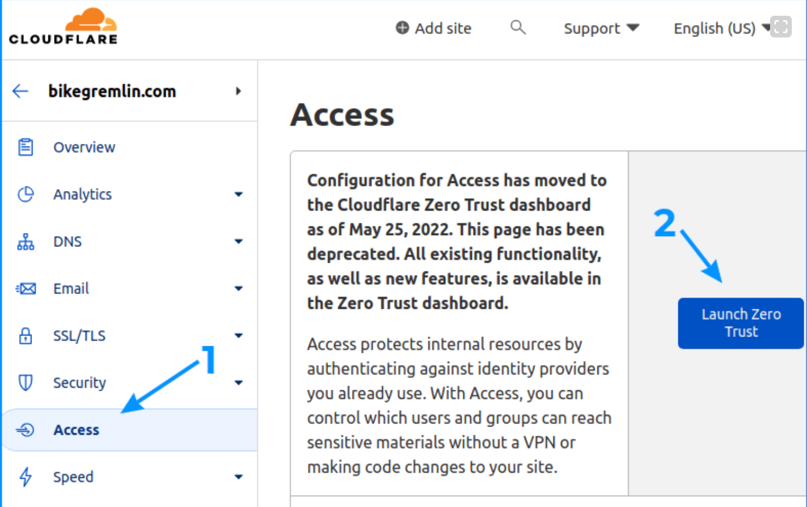

Then, choosing the Cloudflare account to configure Zero Trust for
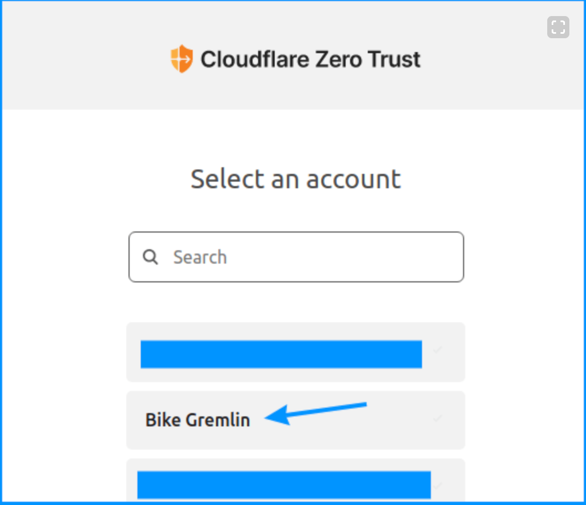

Within the Zero Trust dashboard, locate and click on “Network > Tunnels“, then select “Add a tunnel“.
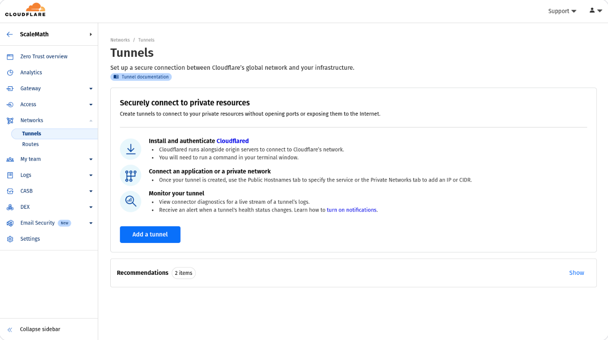

Select Tunnel type: Select the “Cloudflared” method and click “Next”
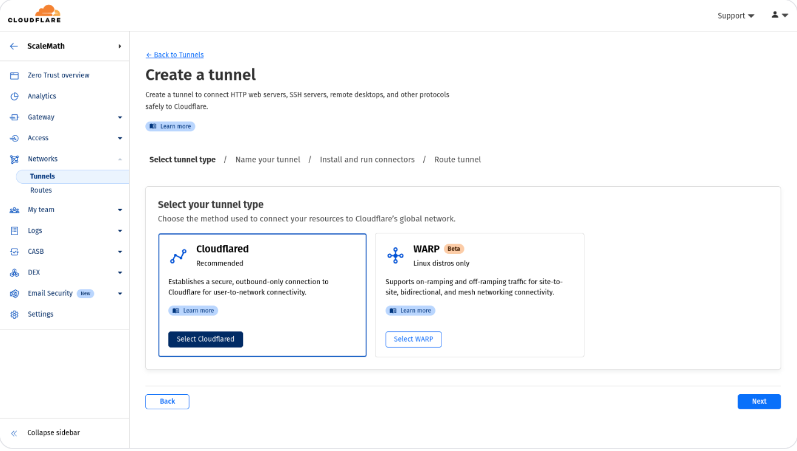

Name Your Tunnel: Provide a descriptive name for your tunnel (e.g., “MyHomeServerTunnel”).
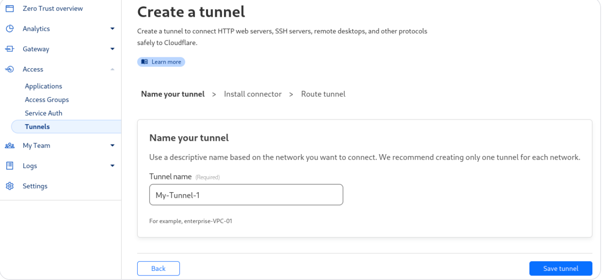

Install the Tunnel Connector: After providing the name, you must install the Cloudflare binary on your server to establish a tunnel connection. You can do this easily by logging in to your server via SSH and executing the command on the screen.
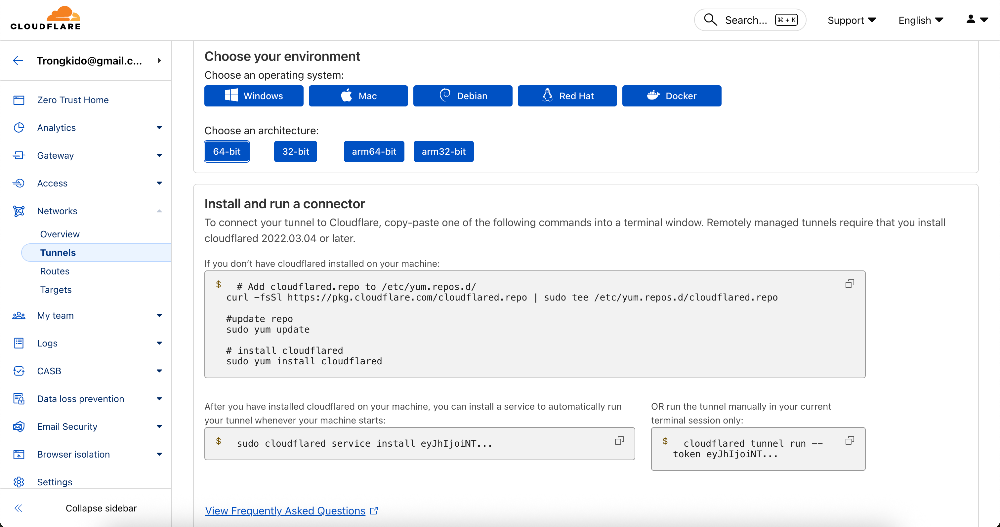

```bash
# Add cloudflared.repo to /etc/yum.repos.d/ 
curl -fsSl https://pkg.cloudflare.com/cloudflared.repo | sudo tee /etc/yum.repos.d/cloudflared.repo

#update repo
sudo yum update

# install cloudflared
sudo yum install cloudflared

cloudflared service install <token>
# or
cloudflared tunnel run --token <token>
```

> [!NOTE]
> Your server which install Cloudflare binary need to have connection to your kubenetes cluster.

Verify Tunnel Connection: After executing the command on your server, return to the Cloudflare Zero Trust dashboard. Your newly created tunnel should be listed at the bottom of the screen (as shown in the above screenshot), and its status should show as “Healthy“.
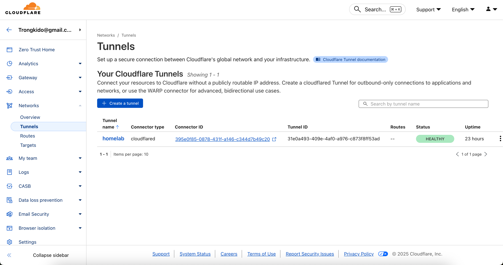

Then, you can config cloudflare to point to your web via ingress running in kubenetes cluster
First, go to config screen as image below
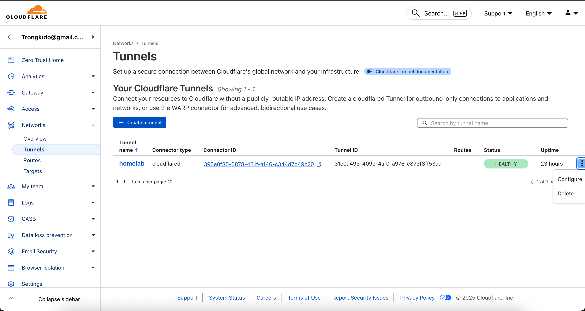

Then, go to "Published application routes", then click to "Add a published application route"
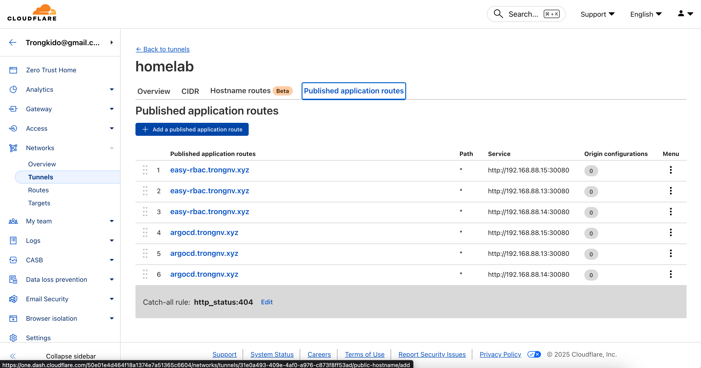

Add a new route to point to your web domain with ingress config, you need to wait Cloudflare create a new record for your
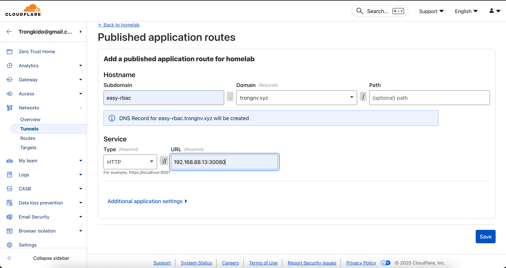

Now, access to your web from internet
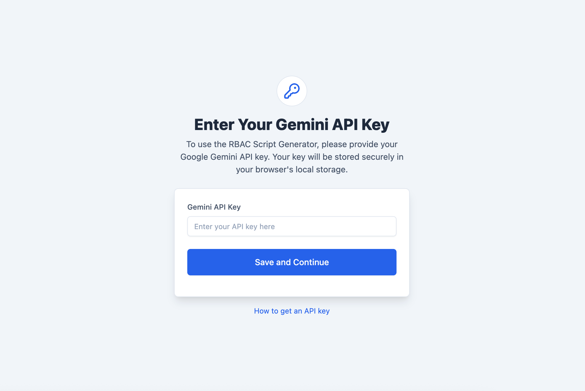
